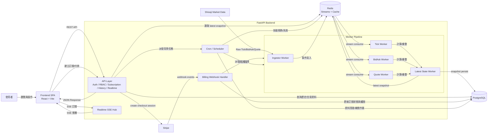
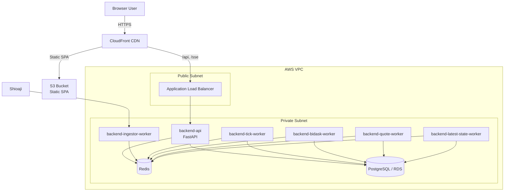
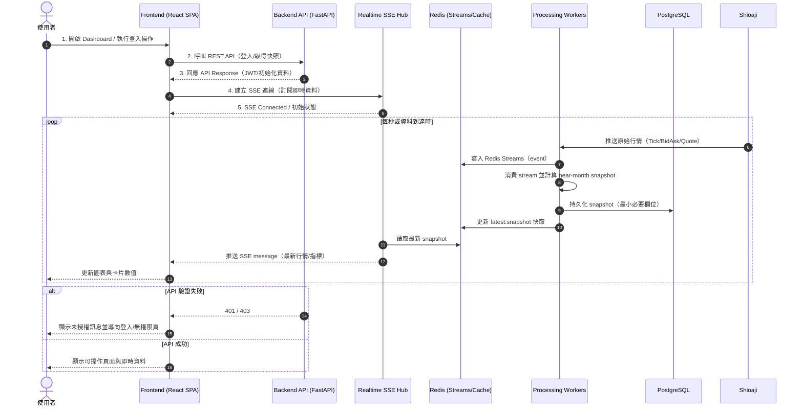
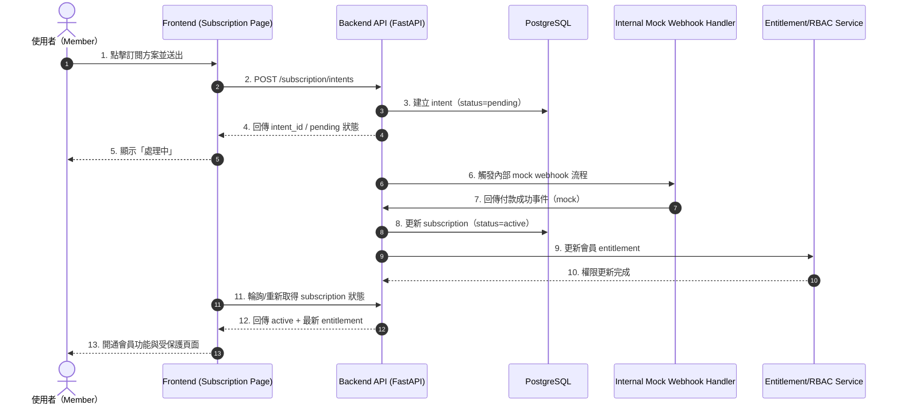
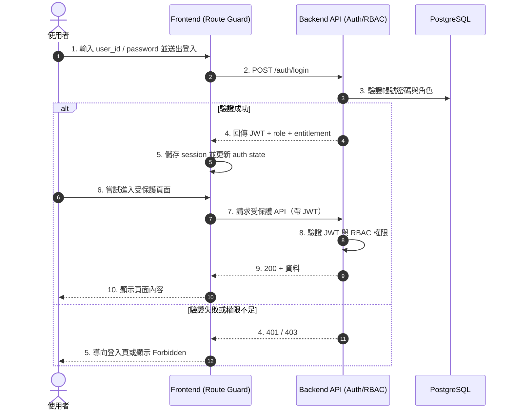

# Trading Monitoring Dashboard

## Overview

Trading Monitoring Dashboard 是一個以台指近月期貨監控為核心的全端 Monorepo 專案。系統以 Shioaji 作為行情來源，透過 Redis Streams 串接後端計算與快取，再由 SSE（Server-Sent Events）每秒推送最新快照到前端儀表板。系統功能包含登入注冊服務、角色權限控管、email通知、即時台指籌碼分析儀版表（漲跌家數差比/籌碼强弱/台指振幅/預估量量差比/價差/貢獻點數/現貨溫度計）、市場溫度計、市場熱力圖、盤後籌碼爬蟲服務、盤後籌碼分析服務、audit log監控等等

MVP 目標聚焦於：

- 近月台指期即時監控
- JWT 驗證與 RBAC（`admin` / `member` / `visitor`）
- 訂閱流程（Mock Webhook）
- 可持續擴充的模組化後端架構

## Demo

本地啟動（建議使用 Docker Compose）：

```bash
docker compose up -d redis backend-api backend-ingestor-worker backend-tick-worker backend-bidask-worker backend-quote-worker backend-latest-state-worker frontend
```

啟動後可使用：

- Frontend: `http://localhost:5173`
- Backend API: `http://localhost:8000`
- RedisInsight: `http://localhost:5540`

> 註：實際可用頁面與測試帳號請依 `.env` 與目前資料庫狀態為準。

## Features

- 即時行情監控：透過 SSE 每 1 秒推送最新快照
- 市場資料管線：Shioaji -> Redis Streams -> 指標/快照計算 -> Redis/PostgreSQL
- 角色權限控管：前端路由守衛 + 後端 RBAC 強制驗證
- 訂閱狀態流：支援訂閱意圖、狀態更新與 mock webhook 流程
- 管理與審計能力：保留 admin 操作與 audit 事件記錄基礎
- 模組化工作者：將 ingestion、stream processing、email、analytics 等工作拆分為獨立 worker

## Tech Stack

- Frontend: React 19 + TypeScript + Vite
- UI/State: shadcn/ui、Tailwind CSS、React Query、Zod、React Hook Form、Zustand
- Backend: FastAPI + SQLAlchemy + Alembic
- Data Layer: PostgreSQL（交易資料）+ Redis（快取/訊息流）
- Messaging/Realtime: Redis Streams + SSE
- Infra/DevOps: Docker Compose、AWS

## Architecture

整體採用 Monorepo + Modular Monolith 後端策略：

- `apps/frontend`：儀表板 UI、路由守衛、SSE client
- `apps/backend`：API、認證授權、訂閱流程、行情處理與多工 worker
- `packages/shared`：跨前後端共用契約與設定
- `infra`：部署與環境設定（含 compose）
- `docs`：PRD、設計稿、實作計畫與流程文件

核心設計原則：

- API 與 Worker 職責分離
- 後端作為權限與資料正確性的唯一真相來源
- Redis 承擔即時資料中繼與 latest snapshot 快取
- 前端專注展示與互動，不重算後端已計算指標



### Deployment Architecture（AWS: CloudFront + S3 + VPC）



## Folder Structure

```txt
trading-monitoring-dashboard/
├─ apps/
│  ├─ frontend/                 # React SPA
│  │  └─ src/
│  │     ├─ app/
│  │     ├─ features/
│  │     ├─ components/
│  │     ├─ lib/
│  │     └─ styles/
│  └─ backend/                  # FastAPI + workers
│     ├─ app/
│     │  └─ modules/
│     ├─ workers/
│     ├─ tests/
│     └─ alembic/
├─ packages/
│  └─ shared/
│     ├─ config/
│     └─ contracts/
├─ infra/
├─ docs/
├─ openspec/
└─ README.md
```

## Sequence Flow

此流程描述「即時行情」從使用者進入頁面、前後端建立資料通道，到後端工作者處理資料並回推前端的完整生命週期。  
重點在於 request/response、SSE 長連線、以及 Redis Streams + snapshot 快取的資料流分工。



### Subscription Flow（Mock Webhook）

此流程描述會員送出訂閱後，系統如何先建立 intent，再透過 mock webhook 將狀態推進到 active。  
重點在於 subscription 狀態轉換與 entitlement/RBAC 的同步更新。



### Login + RBAC Guard Flow

此流程描述登入成功後如何取得 JWT 與角色，並在後續呼叫受保護 API 時完成權限驗證。  
重點在於 `401/403` 的失敗分支與前端 route guard 的對應行為。



## Challenges & Solutions

### 1) Realtime 資料更新頻率高，前端容易抖動與重算過多
- Challenge：SSE 每秒推送資料，圖表與狀態同步時容易造成不必要 re-render。
- What I did：將 realtime 更新做批次處理與 timeline helper 抽象，降低單筆事件直接觸發 UI 更新的頻率。
- Result：畫面更新更穩定，元件責任更清楚，測試也更容易覆蓋。

### 2) 市場資料管線需要兼顧即時性與一致性
- Challenge：Tick/BidAsk/Quote 來源與處理節點多，若沒有清楚分層容易造成資料狀態混亂。
- What I did：採用 Redis Streams 作為事件骨幹，worker 分工處理，並將 latest snapshot 寫入 Redis + PostgreSQL。
- Result：兼顧即時讀取與持久化，API 可直接讀取快照，歷史查詢走資料庫。

### 3) 權限與訂閱流程在 MVP 與 Production 差異大
- Challenge：MVP 需要快速交付，但架構又要能銜接 Stripe/webhook 的 production 流程。
- What I did：在 README 與架構設計中明確拆分 MVP（mock webhook）與 Production（Stripe + webhook ingress + scheduler）。
- Result：開發與溝通成本降低，團隊能清楚知道目前範圍與後續擴充路徑。

### 4) Worker 與 HTTP API 職責拆分，避免即時資料堵塞 API
- Challenge：realtime data 與 HTTP API 放在同一處理脈絡時，即使使用 `asyncio.create_task`，在高頻資料下仍可能互相競爭資源並影響回應。
- What I did：將資料流處理獨立為多個 worker（如 `ingestor`、`tick`、`bidask`、`quote`、`latest-state`），API layer 專注在 request/response。
- Result：降低 API 被即時資料處理阻塞的風險，整體穩定性更好。

### 5) DB Sink 與 Stream Processing 解耦，降低 I/O 阻塞
- Challenge：原本 DB sink 與 stream processing 在同一 worker 路徑處理，遇到資料庫寫入延遲時會拖慢消費。
- What I did：將 DB sink 改為獨立 flush 路徑，並在 async flush 使用 `asyncio.to_thread(...)` 執行批次持久化（tick、bidask 皆已採用）。
- Result：event loop 被同步寫入阻塞的機率下降，資料流消費更平穩。

### 6) 前端由全量更新改為增量 + 批次，並把 SSE 收集搬到 Web Worker
- Challenge：早期全量更新 state、未限流 UI 更新，且 SSE 解析/收集在主執行緒，導致卡頓與記憶體偏高。
- What I did：改為增量更新；SSE 先收集一段時間再批次套用；解析與收集移至 Web Worker；realtime manager 做批次合併後更新 store。
- Result：主執行緒負擔降低，畫面更新更順，記憶體用量更可控。

### 7) 前端重算控制（`useMemo` / `memo`）
- Challenge：高頻資料下，衍生資料與圖表容易重複計算與重渲染。
- What I did：在關鍵計算與元件渲染路徑加入 `useMemo`、`memo` 與節流訂閱策略。
- Result：減少不必要 render 與運算成本，提升互動流暢度。

## Roadmap

- 補強歷史資料回補與分析管線（Historical Analytics）
- 擴充多商品/多市場監控能力
- 強化管理後台與審計查詢體驗
- 依容量需求評估 SSE -> WebSocket 升級策略
- 完成更多非功能測試（連線數、重連、容錯壓測）與觀測能力
- 規劃分散式部署（由單一 EC2 拆分 API / Worker / DB）
- 圖表引擎升級為 Canvas-based 方案（評估 TradingView 類型）
- 補齊高風險路徑結構化 log，串接 CloudWatch 監控告警
- 新增夜盤資料處理與展示能力
- 新增 LINE Bot 行情查詢服務

## Author

- Dickson
